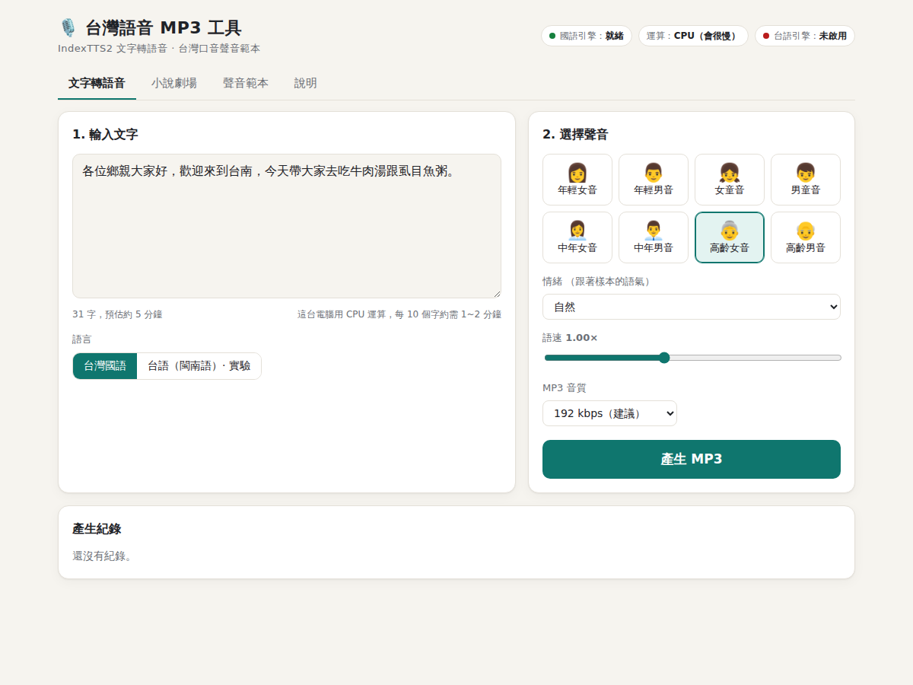
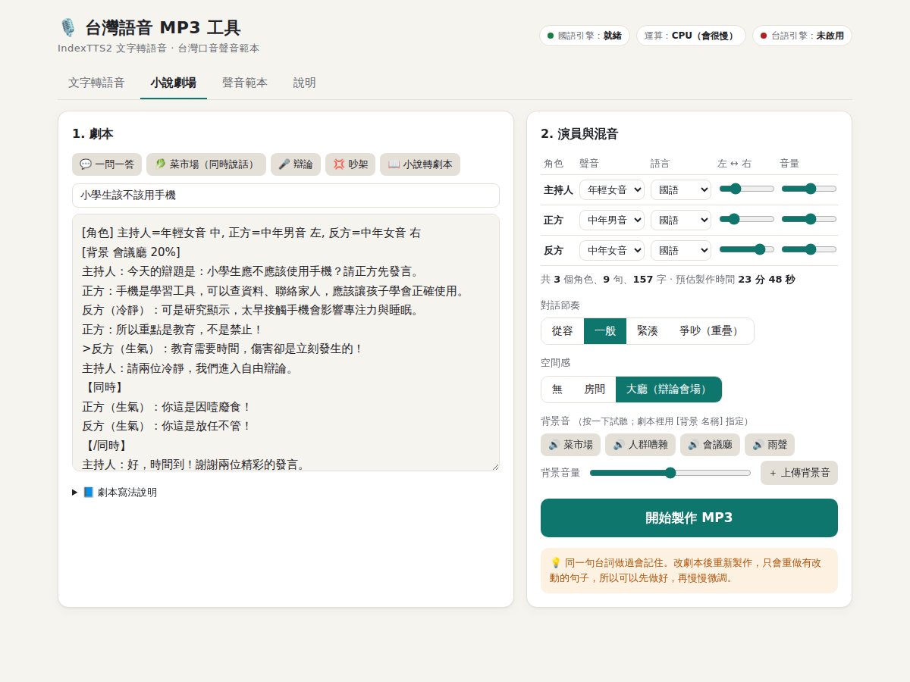

# 🎙️ 台灣語音 MP3 工具（IndexTTS2 網頁版）

用 [IndexTTS2](https://github.com/index-tts/index-tts) 在自己的 Windows 電腦上架設**文字轉語音網站**，產生**台灣口音**的 MP3。支援 8 種聲音、多角色的「小說劇場」、台語（實驗性），也可以加到手機桌面當 App 使用。



## 功能

- **文字轉語音**：繁體中文 → MP3，可調情緒、語速、音質
- **8 種台灣口音聲音**：年輕、中年、高齡的男女聲，以及男童、女童音；每種都可以自己錄音或上傳樣本
- **小說劇場**：4~5 個角色對話，輸出一個立體聲 MP3
  - 一問一答、搶話、同時說話（菜市場叫賣、辯論、吵架）
  - 背景環境音：菜市場、人群、會議廳、雨聲，也可以自訂
  - 貼上小說內文，自動轉成劇本
  - 台詞快取：改劇本只重做有變的句子
- **台語（閩南語）**：另外接 MERaLiON OmniVoice Hokkien 模型（選配、實驗性）
- **手機捷徑**：網址小圖示、iPhone / Android「加入主畫面」

## 文件

| 文件 | 內容 |
|---|---|
| [01 安裝過程](docs/01-安裝過程.md) | 安裝步驟，以及實際安裝時遇到的 6 個問題與解法 |
| [02 系統說明](docs/02-系統說明.md) | 架構、領域模型、混音原理、API 一覽、效能 |
| [03 使用說明](docs/03-使用說明.md) | 文字轉語音、小說劇場寫法、聲音範本、手機捷徑、上線 |

## 快速開始（Windows）

需要：Anaconda、git、[uv](https://docs.astral.sh/uv/)，以及約 15 GB 的硬碟空間。

```bat
cd %USERPROFILE%
git clone https://github.com/index-tts/index-tts.git
```

把本 repo 放到任意資料夾（例如 `E:\Index TTS2\`），然後依序雙擊：

1. `install_indextts2.bat`：安裝 IndexTTS2 並下載模型（30~60 分鐘）
2. `install_hokkien.bat`：（選配）安裝台語引擎
3. `start_server.bat`：啟動網站，瀏覽器會自動打開 <http://127.0.0.1:7861>

沒有 NVIDIA 顯示卡也能用，會自動改用 CPU，但速度較慢（每 10 個字約 1~2 分鐘）。

## 小說劇場範例

```
[角色] 阿嬤=高齡女音 右, 小美=年輕女音 左, 魚販=中年男音
[背景 菜市場 45%]
旁白：星期天早上，傳統市場裡人聲鼎沸。
【同時】
魚販：來喔！現撈的虱目魚，一尾一百！
小美（開心）：阿嬤，我要吃肉圓！
【/同時】
阿嬤：一尾一百太貴了，算八十啦。
>魚販（開心）：好啦好啦，阿嬤說了算！
```



## 程式結構

```
app/
├─ server.py          FastAPI 網站與 API
├─ domain.py          領域模型：聲音範本、配音工單、成品
├─ engines.py         IndexTTS2（國語）、台語引擎窗口
├─ drama.py           小說劇場：劇本解析、小說轉劇本、混音、背景音
├─ audio.py           ffmpeg：WAV→MP3、語速
├─ prepare_voices.py  從開放資料集挑選台灣口音樣本
├─ hokkien_worker.py  台語引擎（獨立 Python 環境）
└─ static/            網頁、圖示、PWA
install_indextts2.bat / install_hokkien.bat / start_server.bat
```

## 授權與致謝

- 語音模型：[IndexTTS2](https://github.com/index-tts/index-tts)（bilibili，請遵守其模型授權）
- 台語模型：[MERaLiON OmniVoice Hokkien TTS](https://huggingface.co/MERaLiON/MERaLiON-OmniVoice-Hokkien-TTS)（MERaLiON-3 Public Licence）
- 聲音樣本候選：Common Voice 台灣華語（CC0）、[TaigiSpeech](https://huggingface.co/datasets/TaigiSpeech/TaigiSpeech)（CC BY 4.0）
- 個人的聲音樣本與產生的 MP3 **不包含在本 repo 中**
- 請勿用本工具冒充特定真人的聲音
