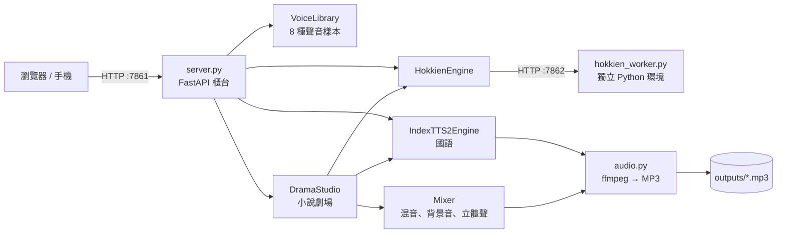
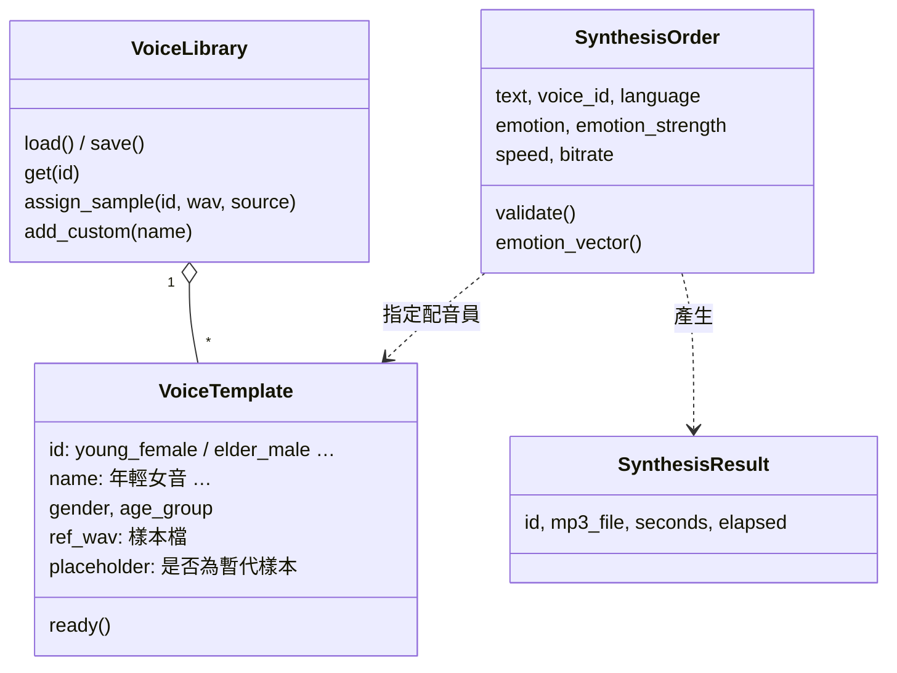
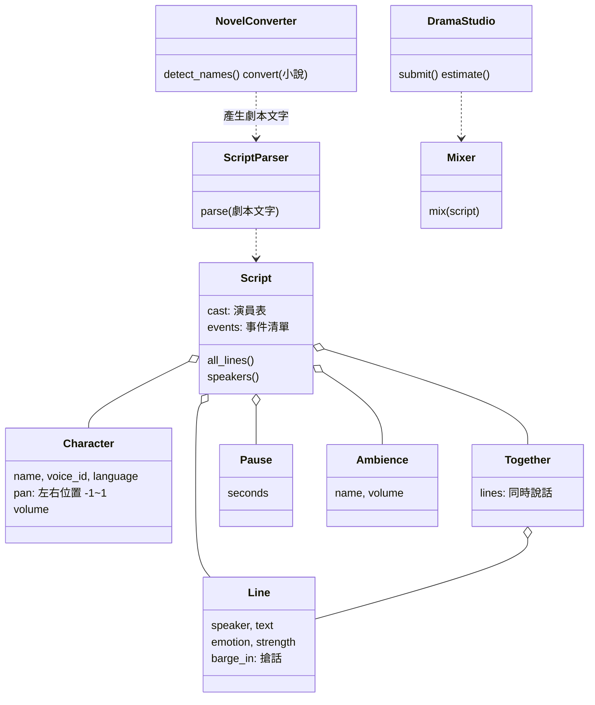

# 02 系統說明

這份文件說明系統怎麼組成、每支程式負責什麼，以及網頁和伺服器之間的 API。程式照「領域模型」拆分，每個類別都對應真實世界的一個角色。

---

## 一、整體架構

用「錄音室」來比喻：

| 真實世界 | 程式 | 檔案 |
|---|---|---|
| 客人下單的櫃台 | FastAPI 網站 | `server.py` |
| 配音員名冊 | `VoiceLibrary`、`VoiceTemplate` | `domain.py` |
| 配音工單 | `SynthesisOrder` | `domain.py` |
| 錄音師（國語） | `IndexTTS2Engine` | `engines.py` |
| 錄音師（台語） | `HokkienEngine` → `hokkien_worker.py` | `engines.py` |
| 後製室 | ffmpeg：轉 MP3、調語速 | `audio.py` |
| 廣播劇團 | `DramaStudio`、`Mixer` | `drama.py` |



**為什麼台語引擎要獨立一個 Python 環境？**
兩個模型需要的 `transformers` 版本互相衝突。分開安裝，就像兩位錄音師各自用自己的器材。它們之間用本機 HTTP（port 7862）溝通。

---

## 二、檔案說明

```
app/
├─ server.py          網站與 API（櫃台）
├─ domain.py          領域模型：VoiceTemplate、VoiceLibrary、SynthesisOrder、SynthesisResult
├─ engines.py         IndexTTS2Engine（國語）、HokkienEngine（台語窗口）
├─ audio.py           ffmpeg 工具：WAV→MP3、語速、整理上傳樣本
├─ drama.py           小說劇場：劇本解析、小說轉劇本、混音、背景音、工單排程
├─ prepare_voices.py  從開放資料集挑選台灣口音的聲音樣本
├─ hokkien_worker.py  台語引擎工作站（在 hokkien-py311 環境執行）
├─ selftest.py        安裝後的自我測試
└─ static/
   ├─ index.html      網頁介面（單一檔案，沒有外部相依）
   ├─ manifest.webmanifest   手機「加入主畫面」設定
   ├─ sw.js           Service Worker（讓 Android 可以安裝成 App）
   └─ icons/          網址小圖示、手機桌面圖示
```

---

## 三、領域模型

### 1. 單句文字轉語音（`domain.py`）



**8 種預設聲音：**

| id | 名稱 | id | 名稱 |
|---|---|---|---|
| `young_female` | 年輕女音 | `young_male` | 年輕男音 |
| `girl` | 女童音 | `boy` | 男童音 |
| `middle_female` | 中年女音 | `middle_male` | 中年男音 |
| `elder_female` | 高齡女音 | `elder_male` | 高齡男音 |

**情緒：** IndexTTS2 使用 8 維情緒向量，順序固定為
`[開心, 生氣, 悲傷, 害怕, 厭惡, 低落, 驚訝, 平靜]`。
選「自然」時不傳向量，語氣會跟著樣本本身。

### 2. 小說劇場（`drama.py`）



**製作流程：**

1. `ScriptParser` 把劇本文字讀成 `Script`。沒指定聲音的角色會依名字自動猜，例如「阿嬤」配高齡女音、名字有「美、婷、玲」配女聲。
2. `DramaStudio` 把工單排進佇列，由背景執行緒一句一句錄製：
   - 同一個聲音的句子排在一起做，模型可以重複使用聲音特徵
   - 每句存進 `cache/lines/<雜湊>.wav`。雜湊由「文字＋情緒＋聲音＋樣本檔更新時間」組成，改劇本時只重做有變的句子
3. `Mixer` 把每句放到時間軸上：
   - **一般句**：接在上一句後面，間隔依節奏決定（從容 0.7 秒、一般 0.4 秒、緊湊 0.15 秒、爭吵 -0.15 秒，也就是重疊）
   - **搶話 `>`**：在上一句結束前 0.4~0.8 秒切進來
   - **同時 `【同時】`**：同一段的每句在 0~0.9 秒內陸續開口
   - **立體聲**：依角色的 `pan` 做等功率聲像，左右分開
   - **空間感**：用衰減雜訊當空間響應做卷積（房間約 0.35 秒、大廳約 1.1 秒）
4. 最後峰值標準化，輸出 192 kbps 立體聲 MP3。

**背景音怎麼做出來的（不用下載任何音效）：**

| 背景 | 做法 |
|---|---|
| 菜市場 | 把 8 個聲音樣本隨機剪成 0.8~2.5 秒的片段，疊 9 層成人群聲，再加 2 層較近的叫賣聲、粉紅雜訊底噪，以及偶爾的碗盤、塑膠袋聲 |
| 人群嘈雜 | 12 層人聲片段，濾掉高頻，聽起來比較遠 |
| 會議廳 | 3 層小聲交談加上低頻空調底噪 |
| 雨聲 | 濾波後的白雜訊，加上緩慢的強弱變化 |
| 自訂 | 使用者上傳的音檔，會重複播放到需要的長度 |

### 3. 小說轉劇本（`NovelConverter`）

- 找出所有「」『』裡的對話
- **說話者**：優先找引號前那一句的主詞，例如「阿明拉著阿嬤走過來，大聲問：」判斷為阿明；其次找「阿嬤生氣地罵：」這種說話標記；再找引號後面，例如「……」小美笑著說
- **角色名**：沒提供名單時，取每個說話標記子句開頭的 2~3 個字當候選，再依在全文出現的次數挑選
- **情緒**：由動詞推測。罵、吼、怒 → 生氣；笑 → 開心；哭 → 悲傷；嘆 → 低落；驚 → 驚訝
- **找不到說話者**：沿用「上上一位」說話者（一問一答通常兩人輪流），並加上「？」提醒使用者檢查
- **其他敘述**：轉成旁白（可以關掉）

---

## 四、聲音樣本從哪來

IndexTTS2 是「零樣本聲音複製」：聽 5~15 秒的樣本，就用那個人的音色、口音說話。所以**樣本是台灣人，說出來就是台灣腔**。

`prepare_voices.py` 會從兩個開放授權資料集挑選候選樣本：

| 來源 | 授權 | 用途 |
|---|---|---|
| Common Voice 台灣華語（經 `adi-gov-tw/Taiwan-Tongues-ASR-CE-dataset-zhtw`） | CC0 | 有性別、年齡層標記，用來挑年輕、中年、青少年的聲音 |
| `TaigiSpeech/TaigiSpeech` | CC BY 4.0 | 台灣長輩的台語錄音（多數 54 歲以上），補足高齡聲音 |

- 找不到青少年聲音時，會用年輕女聲升調「暫代」童音，網頁上會標示「暫代」
- 使用者也可以在網頁上直接錄音或上傳樣本，取代預設樣本
- 樣本屬於個人資料，`.gitignore` 已排除，不會上傳到 GitHub

---

## 五、API 一覽

所有 API 都在 `http://<主機>:7861`。設定 `TTS_PASSWORD` 後，要帶 `x-access-key` header 或 `?key=` 參數。

### 文字轉語音

| 方法 | 路徑 | 說明 |
|---|---|---|
| GET | `/api/status` | 引擎狀態、運算裝置、可用情緒 |
| GET | `/api/progress` | 目前產生進度（第幾段 / 共幾段、預估剩餘秒數） |
| POST | `/api/tts` | 產生 MP3。body：`{text, voice_id, language, emotion, emotion_strength, speed, bitrate}` |
| GET | `/api/history` | 產生紀錄 |
| DELETE | `/api/history/{id}` | 刪除一筆紀錄與檔案 |
| GET | `/outputs/{檔名}.mp3` | 下載 MP3 |

### 聲音範本

| 方法 | 路徑 | 說明 |
|---|---|---|
| GET | `/api/voices` | 所有聲音與候選樣本 |
| GET | `/api/voices/{id}/sample` | 試聽樣本 |
| POST | `/api/voices/{id}/sample` | 上傳或錄音（任何格式，自動轉 24kHz 單聲道） |
| POST | `/api/voices/{id}/use_candidate/{檔名}` | 改用某個候選樣本 |
| POST | `/api/voices` | 新增自訂聲音 `{name}` |
| DELETE | `/api/voices/{id}` | 刪除自訂聲音 |

### 小說劇場

| 方法 | 路徑 | 說明 |
|---|---|---|
| POST | `/api/drama/parse` | 解析劇本 `{script, cast}`，回傳角色、句數、預估時間 |
| POST | `/api/drama/convert` | 小說轉劇本 `{prose, names, narration}` |
| POST | `/api/drama/jobs` | 開始製作 `{script, cast, title, pace, room, ambience_volume}` |
| GET | `/api/drama/jobs/{id}` | 查詢進度：第幾句、目前在錄哪句、預估剩餘時間 |
| GET | `/api/ambience` | 內建與自訂背景音清單 |
| GET | `/api/ambience/preview/{名稱}` | 試聽 8 秒背景音 |
| POST | `/api/ambience?name=` | 上傳自訂背景音 |

### 手機捷徑

| 路徑 | 說明 |
|---|---|
| `/manifest.webmanifest` | App 名稱、圖示、主題色 |
| `/sw.js` | Service Worker（只快取網頁外殼，API 一律走網路） |
| `/favicon.ico`、`/static/icons/*` | 網址小圖示、iPhone / Android 桌面圖示 |

---

## 六、效能參考（Intel i5-1240P、只用 CPU）

| 項目 | 時間 |
|---|---|
| 啟動網站、載入 IndexTTS2 模型 | 約 2 分鐘 |
| 每 1 秒語音的計算時間 | 10~27 秒 |
| 30 字左右的一句話 | 3~5 分鐘 |
| 9 句的小說劇場範本 | 約 6~7 分鐘 |
| 已快取的句子 | 幾乎不花時間 |

有 NVIDIA 顯示卡時，程式會自動改用 GPU 與半精度（FP16），速度可以快 20 倍以上。

---

## 七、已知限制

- **台語**：IndexTTS2 本身只會國語和英語。台語使用 MERaLiON OmniVoice Hokkien，它以新加坡福建話訓練，搭配台灣長輩的樣本後腔調會接近，但不完全等於台灣台語
- **童音**：開放資料集中幾乎沒有台灣兒童的聲音，建議自行錄製（需家長同意）
- **大陸讀音**：少數字會唸成大陸讀音，例如「垃圾」「星期」，可以改寫成同音字
- **重新啟動**：重新啟動網站會中斷正在產生的單句語音；小說劇場已完成的句子仍保留在快取中
