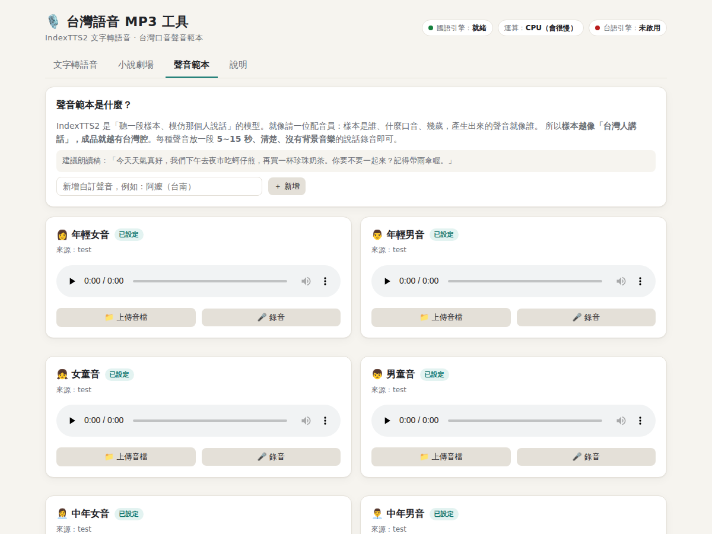
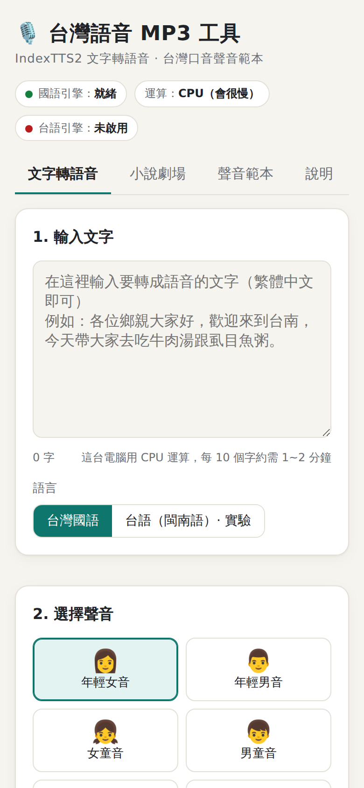

# 03 使用說明

## 啟動

1. 雙擊 `start_server.bat`
2. 等瀏覽器自動打開 <http://127.0.0.1:7861>
3. 右上角顯示「國語引擎：就緒」就可以開始使用（第一次啟動約 2 分鐘）
4. 用完直接關掉黑色視窗

---

## 一、文字轉語音


1. **輸入文字**：直接打繁體中文，下方會先估計要等多久
2. **選語言**：台灣國語，或台語（實驗性，需安裝台語引擎）
3. **選聲音**：8 種聲音擇一
4. **情緒**：
   - 「自然」會跟著樣本本身的語氣
   - 選其他情緒時，可以調整強度
5. **語速**：0.6~1.6 倍，產生後才調整，不會改變音高
6. **MP3 音質**：128 / 192 / 320 kbps
7. 按「**產生 MP3**」，會顯示「第幾段 / 共幾段、預估還要多久」
8. 完成後可以直接播放、下載，下方「產生紀錄」會保留最近 200 筆

MP3 同時存放在 `app\outputs\`。

> 💡 只用 CPU 的電腦大約每 10 個字要 1~2 分鐘。建議先用一句短話試聽，滿意再做長文。

---

## 二、小說劇場（多角色對話）


### 最快上手：用範本

按上方任一個範本，再按「開始製作 MP3」：

| 範本 | 示範什麼 |
|---|---|
| 💬 一問一答 | 記者訪問阿公，兩人輪流說話 |
| 🥬 菜市場 | 5 個角色、叫賣聲同時開口，加上菜市場背景音 |
| 🎤 辯論 | 主持人與正反方，大廳回音，最後互嗆 |
| 💢 吵架 | 夫妻搶話、同時大吼，小孩害怕地勸架 |

### 劇本寫法

```
# 井號開頭是註解
[角色] 阿明=年輕男音 左, 阿嬤=高齡女音 右 台語, 老闆=中年男音 80%
[背景 菜市場 40%]
[停頓 1.5]

阿明：一般台詞
阿嬤（生氣）：加上情緒
阿嬤（生氣80%）：情緒加上強度
>阿明：開頭加 > ＝ 搶話，上一句還沒講完就插進來

【同時】
攤販甲：來喔來喔！
攤販乙：俗俗賣喔！
【/同時】

旁白：沒寫角色的行，也會當成旁白
```

| 語法 | 說明 |
|---|---|
| `角色：台詞` | 一行一句；全形「：」或半形「:」都可以 |
| `角色（情緒）：` | 情緒：開心、生氣、悲傷、害怕、厭惡、低落、驚訝、平靜。也看得懂「大吼、罵、笑、哭、無奈、冷靜」等說法 |
| `>角色：` | 搶話，跟上一句重疊 0.4~0.8 秒 |
| `【同時】…【/同時】` | 中間每一句會一起開口：叫賣、互嗆、齊聲 |
| `[角色] 名=聲音 位置 語言 音量%` | 聲音可以寫「年輕男音」等 8 種名稱；位置寫左、中、右；語言寫國語或台語 |
| `[背景 名稱 音量%]` | 菜市場、人群嘈雜、會議廳、雨聲，或自己上傳的背景音；`[背景 無]` 關掉 |
| `[停頓 秒數]` | 空白幾秒 |

### 演員與混音（右側面板）

- **聲音**：每個角色可以另外選聲音，包含自訂聲音
- **語言**：國語或台語。同一齣劇可以混用，例如阿嬤講台語、孫子講國語
- **左 ↔ 右**：立體聲位置，戴耳機可以聽出誰在左邊、誰在右邊
- **音量**：個別調整角色的大小聲
- **對話節奏**：從容、一般、緊湊、爭吵（句子會互相重疊）
- **空間感**：無、房間、大廳（適合辯論會場）
- **背景音**：按一下可以試聽 8 秒；也可以上傳自己的音效，例如從 freesound.org 下載的 CC0 錄音

### 小說轉劇本

1. 按「📖 小說轉劇本」
2. 貼上小說內文，對話要用「」包起來
3. 角色名可以留白，程式會自動偵測
4. 按「轉換 ↓」

例如：

```
阿嬤生氣地罵：「上禮拜才三十，你搶錢喔！」
「現在颱風天嘛。」老闆笑著說。接著他轉身去招呼別的客人。
```

會轉成：

```
阿嬤（生氣）：上禮拜才三十，你搶錢喔！
老闆（開心）：現在颱風天嘛。
旁白：接著他轉身去招呼別的客人
```

找不到說話者的句子會標「？」，例如 `老闆？：……`，請手動修正。

### 製作與重做

- 按「開始製作 MP3」後，會顯示「第幾句 / 共幾句、正在錄哪一句、預估剩餘時間」
- 可以關掉網頁，之後再打開，進度還看得到
- **做過的句子會記住**：修改劇本後重新製作，只會重做有改動的句子
- 完成的作品也會出現在「文字轉語音」分頁的產生紀錄中

---

## 三、聲音範本



每種聲音都可以：

- ▶ 試聽目前的樣本
- 從「候選樣本」中挑選（開放資料集的台灣人聲音）
- 📁 上傳音檔：mp3、wav、m4a、手機錄音都可以
- 🎤 直接在網頁上錄音，最多 15 秒

**好樣本的條件**：5~15 秒、只有一個人說話、沒有背景音樂、說話自然。

建議朗讀稿：
> 今天天氣真好，我們下午去夜市吃蚵仔煎，再買一杯珍珠奶茶。你要不要一起來？記得帶雨傘喔。

也可以「＋ 新增」自訂聲音，例如「阿嬤（台南）」。

---

## 四、手機使用與桌面捷徑



手機要能連到執行網站的那台電腦：

| 情境 | 網址 |
|---|---|
| 同一個 Wi-Fi | `http://電腦的IP:7861`（在電腦上用 `ipconfig` 查 IPv4 位址） |
| 在外面 | 用 ngrok 等工具轉出 https 網址（見下一節） |

**加到手機桌面：**

- **iPhone（Safari）**：開啟網址 → 下方「分享」→「加入主畫面」
- **Android（Chrome）**：開啟網址 → 右上「⋮」→「加到主畫面」或「安裝應用程式」

桌面會出現綠色麥克風圖示，點開後是全螢幕、沒有網址列的 App 畫面。

> 網頁錄音功能只能在 `127.0.0.1` 或 https 網址下使用。在區域網路用 http 開啟時，請改用「上傳音檔」。

---

## 五、開放到網路上

1. 編輯 `start_server.bat`，把這行前面的 `REM` 拿掉，並設定密碼：

   ```bat
   set "TTS_PASSWORD=你的密碼"
   ```

2. 用 ngrok 轉出去：

   ```bat
   ngrok http 7861
   ```

3. 別人打開 ngrok 的 https 網址時，會先要求輸入密碼

> ⚠️ 請勿用本工具冒充特定真人的聲音。對外發布時，建議使用有同意書的自錄聲音。

---

## 六、常見問題

| 問題 | 解法 |
|---|---|
| 瀏覽器顯示「拒絕連線」 | 網站還沒啟動，或黑色視窗被關掉了。請重新雙擊 `start_server.bat` |
| `outputs` 資料夾是空的 | 還在產生中，要等全部段落做完才會存檔。看網頁上的進度 |
| 台語按鈕顯示「未安裝」 | 執行 `install_hokkien.bat`，完成後重新啟動 `start_server.bat` |
| 某些字唸錯，或唸成大陸讀音 | 改寫成同音字，例如「垃圾」寫成「樂色」 |
| 太慢 | 縮短文字；或換到有 NVIDIA 顯示卡的電腦 |
| 出現錯誤訊息 | 查看 `logs\server_log.txt` |
